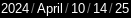

# History

Welcome! Here, you can see the history of the [***PARENT*** repo](https://github.com/trant-official/mini-website), and the changes made at any time.

## How to identify timed items

Here, you can find the items with a time stamp: **DOWN TO THE MINUTE** of each commit that is not in this history folder... lol

The time stamps are like this:

Year/Month/Day/Hour (24 hour format)/minute

In that example the commit was on "10th of April in 2024 at 14:25/02:25 PM"
